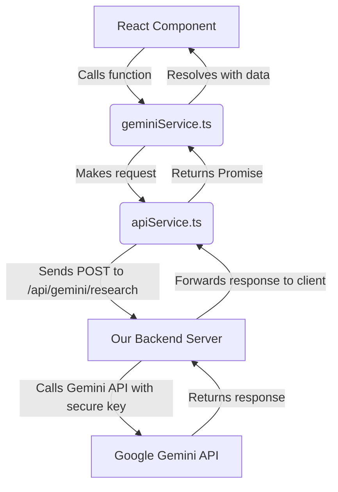

# Eureka² | The Collaborative Ecosystem for Science

<div align="center">
  
</div>

<p align="center">
  <strong>Eureka² (E²) is the collaborative ecosystem for science. We empower career and civilian scientists to share knowledge, collaborate on research, and accelerate discovery. Join us to turn inquiry into action.</strong>
</p>

---

## Table of Contents

- [⭐ About The Project](#-about-the-project)
  - [Project Philosophy](#project-philosophy)
- [🚀 Key Features](#-key-features)
  - [Community & Discourse](#community--discourse)
  - [AI-Powered Writing Tools](#ai-powered-writing-tools)
  - [Project Collaboration](#project-collaboration)
  - [Knowledge & Profile Management](#knowledge--profile-management)
- [🛠️ Built With](#️-built-with)
- [⚙️ Getting Started](#️-getting-started)
  - [Prerequisites](#prerequisites)
  - [Installation](#installation)
- [🏗️ Project Structure](#️-project-structure)
- [🏛️ Architectural Decisions](#️-architectural-decisions)
- [📡 API Services](#-api-services)
  - [Service Communication Flow](#service-communication-flow)
- [🧪 Testing Strategy](#-testing-strategy)
- [🔧 Environment Variables](#-environment-variables)
- [🤝 Contributing](#-contributing)
- [📜 License](#-license)

---

## ⭐ About The Project

Eureka² is a social collaboration platform designed to dismantle the barriers between professional scientific communities and the public. It provides a structured, accessible environment for scientific discourse, project collaboration, and knowledge sharing. The platform is organized around the core principles of the scientific method, with dedicated community spaces for **Inquiry, Discovery, Experiment, Validation, and Implementation.**

At its heart, Eureka² leverages powerful AI tools, powered by the **Google Gemini API**, to assist scientists in their writing and research process, making scientific communication more accessible, rigorous, and efficient for everyone.

### Project Philosophy

> "A Type-1 platform, for a Type-1 future."

Our guiding principle is to create a platform that fosters the kind of open, global collaboration necessary for a civilization to advance. We believe that scientific progress is accelerated when knowledge is democratized and diverse minds can contribute. By providing tools that simplify complex terminology (**Jargon Buster**) and structure the research process (**Guided Writing**), Eureka² aims to empower a new generation of "civilian scientists" to meaningfully engage with and contribute to the scientific frontier alongside career professionals.

---

## 🚀 Key Features

### Community & Discourse

-   **Global Feed**: A central hub to see the latest posts from all communities, providing a broad overview of platform activity.
-   **Structured Communities**: Feeds are categorized by stages of the scientific method, fostering focused, high-signal discussions. A user can post an initial question in `Inquiry` and see the discussion evolve through the subsequent stages.
-   **Real-time Interaction**: Live updates for new posts, comments, and notifications are pushed to clients via WebSockets, creating a dynamic and responsive user experience.
-   **Content Moderation**: Users can report inappropriate posts or comments, which flags the content for administrator review.

### AI-Powered Writing Tools

-   **Writing Workbench**: An integrated editor packed with a suite of AI tools:
    -   **Research & Citations**: Finds relevant academic papers and citations for a given topic.
    -   **Originality Check**: Validates the novelty of a text against existing literature.
    -   **Language Refinement**: Rewrites text for specific audiences (e.g., `Academic` vs. `Public`), improving clarity and impact.
    -   **AI Peer Review**: Simulates a peer-review process, providing constructive feedback on a draft.
-   **Guided Writing Process**: A step-by-step assistant for structuring research:
    1.  **Refine Idea**: Transforms a rough concept into a focused, feasible research question.
    2.  **Find Literature**: Discovers foundational papers based on the refined idea.
    3.  **Create Outline**: Generates a logical structure for a paper or report.
    4.  **Plan Dissemination**: Suggests potential journals or conferences based on an abstract.
-   **Jargon Buster**: Identifies and explains complex scientific terminology in simple, easy-to-understand language, promoting accessibility.

### Project Collaboration

-   **My Projects Dashboard**: A central place to create, view, and manage collaborative research projects.
-   **Recruitment Flags**: Projects can be flagged to recruit `Civilian Scientists` or to signal that they are `Seeking Funding`, making it easy to find collaborators and support.
-   **Member Roles**: Projects have defined roles (`Lead`, `Collaborator`, `Advisor`) to clarify responsibilities.

### Knowledge & Profile Management

-   **Personalized Profiles**: User profiles showcase their role (`Career` or `Civilian Scientist`), bio, interests, and key contribution statistics (posts, projects, reviews).
-   **Knowledge Base**: A curated library of articles, guides, and best practices for both career and civilian scientists.
-   **Bookmarks**: Users can save posts, projects, and articles for later reference.
-   **Notifications**: A real-time notification system keeps users updated on likes, comments, mentions, and project invites.

---

## 🛠️ Built With

-   **[React](https://reactjs.org/)**: A JavaScript library for building user interfaces.
-   **[TypeScript](https://www.typescriptlang.org/)**: A typed superset of JavaScript for robust, scalable code.
-   **[Tailwind CSS](https://tailwindcss.com/)**: A utility-first CSS framework for rapid and consistent UI development.
-   **[Google Gemini API](https://ai.google.dev/)**: Powers all AI-driven features (via a secure backend proxy).
-   **[Jest](https://jestjs.io/) & [React Testing Library](https://testing-library.com/docs/react-testing-library/intro/)**: For comprehensive unit and integration testing.

---

## ⚙️ Getting Started

### Prerequisites

-   [Node.js](https://nodejs.org/) (version 16 or later)
-   `npm` or another package manager like `yarn`

### Installation

1.  **Clone the repository:**
    ```sh
    git clone https://github.com/your-username/eureka-squared.git
    cd eureka-squared
    ```
2.  **Install NPM packages:**
    ```sh
    npm install
    ```
3.  **Start the development server:**
    The application will be served at `http://localhost:3000` and will proxy API requests to a backend server (expected to be running on `http://localhost:8080`).
    ```sh
    npm start
    ```
4.  **Run tests:**
    To run the automated test suite in watch mode:
    ```sh
    npm test
    ```

---

## 🏗️ Project Structure

The codebase is organized to maintain a clear separation of concerns, making it scalable and easy to navigate.

```
/
├── public/                 # Static assets
├── src/
│   ├── __tests__/          # Test files (co-located conceptually)
│   ├── components/         # Reusable React components (UI primitives)
│   │   ├── auth/           # Login, Signup components
│   │   ├── common/         # Spinners, Tooltips, Modals
│   │   └── ...
│   ├── contexts/           # React Context providers for global state (Auth, Socket, Toast)
│   ├── pages/              # Top-level page components (e.g., AuthPage, SettingsPage)
│   ├── services/           # API interaction layer (e.g., authService, postService)
│   ├── App.tsx             # Main application component with page logic
│   ├── index.tsx           # Application entry point
│   ├── types.ts            # Global TypeScript type definitions
│   └── constants.tsx       # App-wide constants (nav items, categories)
├── jest.config.js          # Jest test runner configuration
├── package.json
└── README.md
```

---

## 🏛️ Architectural Decisions

-   **Component-Based Architecture**: The UI is a composition of small, reusable React components, promoting maintainability and consistency.
-   **Separation of Concerns**:
    -   **`services`**: All backend interactions are abstracted into a dedicated services layer. Components are agnostic about the underlying `fetch` implementation.
    -   **`contexts`**: Global state is managed using React Context. This was chosen over Redux for its simplicity and lower boilerplate, as the app's state management needs (auth, sockets) do not require complex middleware or time-travel debugging.
    -   **`components` vs. `pages`**: A clear distinction is made between reusable UI primitives (`components`) and full-page views (`pages` or top-level components like `Profile`, `Projects`).
-   **State Management**:
    -   **Global State**: `AuthContext`, `SocketContext`, and `ToastContext` handle cross-cutting concerns.
    -   **Local State**: `useState` and `useEffect` are used for component-level state, keeping state as close as possible to where it's used.
-   **Real-time Functionality**: WebSockets are used for pushing live updates. The `SocketContext` provides a clean, centralized pub/sub interface (`subscribe`, `unsubscribe`) for any component that needs to react to real-time events.
-   **Error Handling**:
    -   **`ErrorBoundary.tsx`**: A React Error Boundary wraps the entire application to catch rendering errors and display a graceful fallback UI, preventing a full application crash.
    -   **`ToastContext.tsx`**: Provides a non-blocking way to display success, error, or info messages to the user for asynchronous actions (e.g., API calls).
-   **Accessibility (A11y)**: The application strives to be accessible. This includes using semantic HTML, ARIA attributes (`aria-label`, `role`, `aria-expanded`), and managing focus within modals to ensure keyboard navigability.

---

## 📡 API Services

The frontend is a pure client-side application that communicates with a separate backend API for all data persistence, authentication, and AI operations.

-   **`apiService.ts`**: A generic `fetch` wrapper that centralizes API logic. It automatically attaches the JWT `Authorization` token to requests, serializes request bodies, and provides consistent error handling for failed requests.
-   **Domain-Specific Services**: The API layer is further organized by domain (e.g., `authService.ts`, `postService.ts`). This keeps related API calls grouped and makes the codebase easier to understand.
-   **Security**: The frontend **never** interacts with the Google Gemini API directly. This is a critical security measure.

### Service Communication Flow

The flow for AI-powered features is designed to protect credentials and abstract complexity.



> **Note:** This proxy pattern ensures that the Google Gemini API key is never exposed to the browser.

---

## 🧪 Testing Strategy

The project uses Jest and React Testing Library to ensure reliability and facilitate confident refactoring.

-   **Philosophy**: Tests are written from the user's perspective, focusing on behavior rather than implementation details. We query for elements the way a user would find them (by text, label, role) and assert that the UI behaves as expected after user interactions.
-   **`test-utils.tsx`**: A custom `renderWithProviders` utility is used in almost all tests. It wraps the rendered component in all necessary mock context providers (`AuthContext`, `SocketContext`, `ToastProvider`), simulating the real application environment and making tests cleaner and more robust.
-   **Mocking**:
    -   **API Services**: Services like `postService` are mocked using `jest.mock()`. This allows us to test component responses to various API states (loading, success, error) without making actual network requests.
    -   **Child Components**: Complex child components are sometimes mocked (e.g., `CommentSection` in `PostCard.test.tsx`) to isolate the component under test.
-   **Coverage**: The goal is to cover all critical user flows, including authentication, content creation, and interaction with AI tools.

---

## 🔧 Environment Variables

The application relies on the backend to be configured correctly. The frontend expects the following:

-   `API_URL`: The base URL for the backend API. In the provided `apiService`, this defaults to `/api`, which is suitable for local development environments using a proxy. For production deployments, this variable should be set to the absolute URL of the backend.

---

## 🤝 Contributing

Contributions are what make the open-source community such an amazing place to learn, inspire, and create. Any contributions you make are **greatly appreciated**.

1.  Fork the Project
2.  Create your Feature Branch (`git checkout -b feature/AmazingFeature`)
3.  Commit your Changes (`git commit -m 'Add some AmazingFeature'`)
4.  Push to the Branch (`git push origin feature/AmazingFeature`)
5.  Open a Pull Request

---

## 📜 License

Distributed under the MIT License. See `LICENSE.txt` for more information.
```